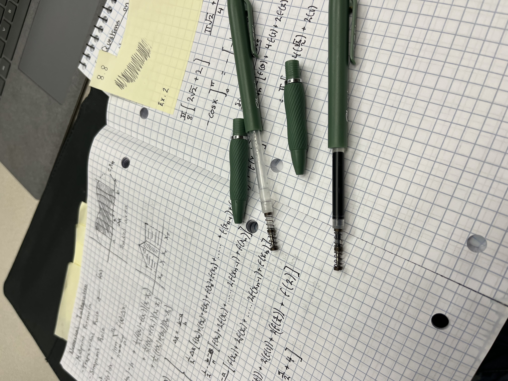
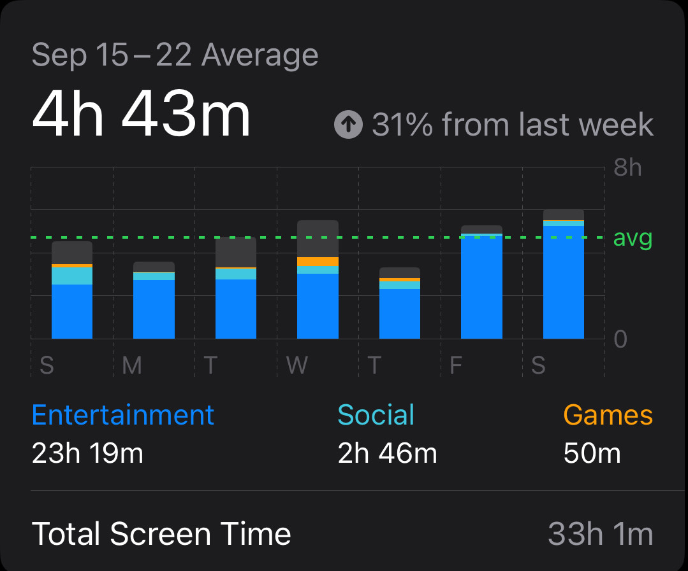
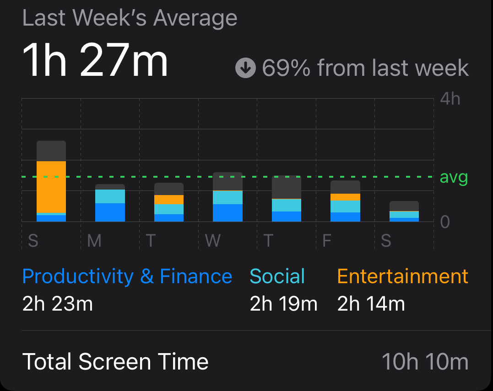

# Digital Media Fast Logbook

## Sunday:

#### Phone/Computer Usage:

- During a car ride from Iowa to Indiana, Listened to educational video on the Bible and did some research, in preparation for College Group (2 hours)
- Audio Book of Dorothy Sayers “Whose Body?” for English (way too long, I want to commit not alive)

#### Withdrawals:

- None that I’ve noticed

#### Side Effects:

- Shorter bathroom breaks
- Seemingly more time in the day
- Much better sleep

#### Notes:

I’ve assumed the rules are that I can use the internet for research and school purposes, but for entertainment I have to find other means that aren’t digital media, like books or physical activities. I have also ruled music as digital media, so I won’t be listening to music either (radio or online). Unless of course there are songs being played around me (I’m not gonna just plug my ears, that would be a little ridiculous).

## Monday:

#### Phone/Computer Usage:

- Data structures homework completed during the lecture because prof. ChowderCurrey is a bum (1 hour)
- Comparing data structures and astronomy answers with Abdelrahman (15 min)
- Studying for Computer Architecture midterm with Kiah (4 hours ☠️⚰️)
- Replying to peers (Dimitri) and friends (Amanda, inviting me to her vb game) over Snapchat (not using it for entertainment just necessary communication) (5 min)
- Continued research for college group (1.5 hours)

#### Withdrawals:

- Increased pick-ups (checking my phone)
- Boredom - Frustration/anger
- Disappointment

#### Side Effects:

- More singing in the shower (normally I play music or podcast)
- Decreased hunger (very interesting) 🤔
- Earlier bedtime

#### Notes:

I’ve decided to fast breakfast and lunch (for reasons :p) , and I haven’t had the hunger levels that I usually experience between my classes and before lunch. I’ve had waves of frustration from thinking about being able to play games or watch any media later today, but when I remind myself that I can’t, it hits me with a shot of frustration. Usually after having my brain tank a barrage of ICBMs (Intercontinental Balistic Missiles) named computer architecture, calculus and programming, I look foreword to turning my brain off for a while, by watching videos or playing online with friends and my brothers. So I’m having to improvise :)

Bro I ran my pen out of ink 😂

## Tuesday:

#### Phone/Computer Usage:

- Studying more for computer architecture midterm (I’m cooked) (1.5 hours)
- Last minute prep for college group (1 hour)

#### Withdrawals:

- Boredom
- Uncertainty (not knowing what to do in downtimes when I’m stranded on campus)

#### Side Effects:

- Feeling less tired (from better sleep)
- Waking up earlier
- Feeling calmer than normal
- Bizarre dreams (which is unusual)

#### Notes:

Midterm wasn’t terrible, I’m still cooked tho. Despite exams I feel calm (I’m usually calm around exams time but this is different). Math exam got moved to next week which extended deadlines, which is frustrating (because I was one of the few who did it on time) but also helpful. Everything is getting done faster since I’m not allowed to consume digital media. I also feel like my brain is working at a higher level than normal (could just be a placebo or some form of bias) 🤷‍♂️

## Wednesday:

#### Phone/Computer Usage:

- Turn in data structures HW and do a LeetCode problem (1.25 hours)
- Last minute studying for english midterm (15 min) (this is all the studying I’ve done for this 😂)
- Math HW (3-4 hours)
- Learning about Raspberry Pis and radios for a project I’m planning over fall break (45 min) Withdrawals:
- Disappointment
- BOREDOM (I’ve been stranded on campus for 7 hours now)

#### Side Effects:

Really bizarre dreams (like am I trippin out on drugs type dreams) Notes: I feel like I’m fading a little but mamma ain’t raise no . . . u know. The weathers been nice (fall is the best) so I’ve taken a couple walks for breaks and it’s nice :) I think I passed my English midterm with floating colors (not quite flying colors) and Dr. Ness brought us chocolates 🍫 Also, I would like to hear if you find anything about these dreams, all I can say is that they are very colorfully visual, unusual and feel like reality (makes me question if anyone spiked my water or slipped some shrooms in my dinner 🤔), it’s really crazy.

## Thursday:

#### Phone/Computer Usage:

- Tried to do math homework (really just stared at the screen waiting for it to solve itself) (1 hour)
- Math HW and LeetCode problem (1 hour) Withdrawals: - Habitually opening up social media (closing it instantly)
- Increased pickups (more than earlier this week)

#### Side Effects:

- Weird dream once again (felt like how parallel universes are depicted in movies)
- Sudden burnout (feeling like doing nothing)
- Wanting to go to bed WAAY earlier

#### Notes:

This day has felt very long, I’ve had just about nothing to do and filling the time has become increasingly difficult (lots of math, lots of reading and lots of push ups) and it gets to the point that I’ve done everything that i should do in a day and I’m fried and need a break. Amanda won her vb game which was cool. Watching the game was about the only eventful thing that happened today.

## Friday:

#### Phone/Computer Usage:

- N/a

#### Withdrawals:

- Bored 🥱

#### Side Effects:

- Weird dream once again (not as trippy but seemed to continue one of my previous dreams)
- Silent car rides
- A cappella in the car

#### Notes:

You know when people say “I’m gonna rip them a new one!” The ‘one’ is referring to their butthole, so they’re gonna rip them a NEW butthole. Interesting 🧐 I work on Fridays so no time for media, but having something to do throughout the day makes it pass quicker, so smooth sailing ⛵️

## Saturday:

#### Phone/Computer Usage:

- Recording in Notes app (this goes for everyday of the week totaling 2.5 hours)
- Re-explaining stuff we learned a year ago to Abdelrahman 🤦‍♂️ (30 min)

#### Withdrawals:

- Nothing new

#### Side Effects:

- Two dreams that were frustrating

#### Notes:

Challenge complete. Not terrible, fairly straightforward. It made it easier with how busy I was with school. The withdrawal symptoms were fairly mellow, and just about what I expected. The dreams were pretty weird, but other than that it was what I expected. I think if I did this over the summer it would be MUCH more challenging, but still manageable. Positives were that the house was clean (I keep it fairly tidy but chores were done in a more timely fashion) homework was done and I got a lot more reading done. Negatives were the amount of extra downtime I have, I’m good at staying on top of my school and studies so I always have the last 2-3 hours of the day for free time, but with this challenge I had like 4-5 hours of free time, and the things I normally do to fill that time were outlawed sooooooo . . . 🥱 boredom ensued along with the other symptoms, and it gets to a point that I’ve done so much homework, so much reading and other physical stuff that I want to explode! I would like something different. But I really enjoyed this challenge and I think from it I’ll adopt some new habits that were forced upon me from the challenge, but at the same time, I am happy for it to be over. I would like to do this again in the future but I would do some planning before and make a couple exceptions (being allowed to play chess 😀) but we’ll see.

#### Control Week:

The majority of what I use my phone for is listening to videos on YouTube, I listen/watch a lot of long form content or debates (normally about the Bible, video games/chess or studying Islam so I can minister to Abdelrahman) and I expected that to go down a LOT

#### Challenge Week:

I logged everything above so you can see my reasons for using apps, and see that I didn’t cheat (this is only my phone data but my computer’s would reflect what I logged above). Almost all of the Productivity & Finance was the Notes app (from logging everything) most of the Social was iMessages and Phone with sprinkles of Snapchat to talk to a couple people who I don’t have their phone number. The entertainment was YouTube which I have reasons listed above ⬆️ I didn’t log absolutely EVERYTHING but the stuff I left out would be irrelevant anyway (like other people using my phone (Noah))
